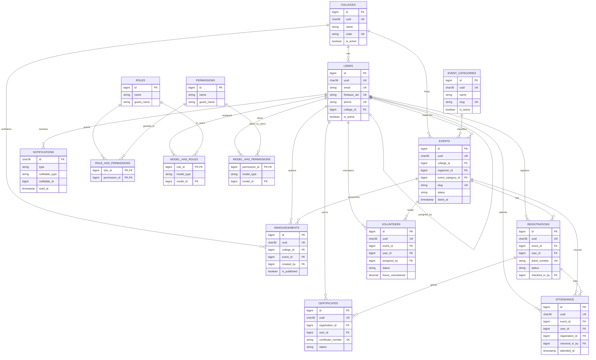

# DuoFest Database Design (MySQL)

Logical ERD. All tables use a big-integer surrogate primary key (`id`) unless
noted. Public resources additionally expose a `uuid` (char(36), unique, indexed)
so IDs are never leaked in URLs or tickets. Foreign keys are inlined with the
`foreignId(...)->constrained()` helpers in the migrations; on-delete behaviour is
shown below each relationship.

## Mermaid ER diagram

## Tables

### users
- PK `id`; UK `email`, `firebase_uid`, `phone`, `uuid`.
- `college_id` FK → `colleges.id`, `ON DELETE SET NULL` (keep accounts if the college goes away).
- `is_active` + `blocked_at` gate access via the `EnsureUserIsActive` middleware.
- Spatie assigns roles/permissions through `model_has_roles` / `model_has_permissions`.

### roles, permissions, role_has_permissions, model_has_roles, model_has_permissions
Spatie `laravel-permission` tables, seeded with the `api` guard. Kept stock.

### colleges
- PK `id`; UK `code`, `uuid`; index `city`.
- 1:N with `users`, `events`, `announcements`.

### event_categories
- PK `id`; UK `slug`, `uuid`; index `(is_active, sort_order)`.
- 1:N with `events` (nullable FK, `ON DELETE SET NULL`).

### events
- PK `id`; UK `slug`, `uuid`; index `status`, `(college_id, status)`, `(starts_at, ends_at)`, `event_category_id`.
- `college_id` FK → `colleges` `ON DELETE CASCADE`.
- `organizer_id` FK → `users` `ON DELETE SET NULL`.
- `event_category_id` FK → `event_categories` `ON DELETE SET NULL`.
- `status` enum values: draft, published, upcoming, live, completed, cancelled.
- `registration_count` is a cached counter maintained by `RegistrationService`.

### registrations
- PK `id`; UK `ticket_number`, `uuid`, composite `(event_id, user_id)`.
- `event_id` FK → `events` `ON DELETE CASCADE`; `user_id` FK → `users` `ON DELETE CASCADE`.
- `checked_in_by` FK → `users` `ON DELETE SET NULL`.
- Composite unique `(event_id, user_id)` enforces one registration per attendee.
- `status` enum values: pending, confirmed, checked_in, cancelled, refunded.

### volunteers
- PK `id`; UK `uuid`, composite `(event_id, user_id)`.
- `event_id` FK → `events` `ON DELETE CASCADE`; `user_id` FK → `users` `ON DELETE CASCADE`.
- `assigned_by` FK → `users` `ON DELETE SET NULL`.
- `status` enum values: assigned, accepted, completed, cancelled.
- Replaces the old `volunteer_slots` + `volunteer_slot_user` pair: one normalized
  row per (event, user) carries the role, shift window and hours worked.

### attendance
- PK `id`; UK `uuid`, composite `(event_id, user_id)`.
- `event_id`/`user_id` FK → `events`/`users` `ON DELETE CASCADE`.
- `registration_id` FK → `registrations` `ON DELETE SET NULL` (optional ticket link).
- `checked_in_by` FK → `users` `ON DELETE SET NULL`.
- `status` enum values: present, late, excused.

### certificates
- PK `id`; UK `certificate_number`, `uuid`.
- `registration_id` FK → `registrations` `ON DELETE CASCADE` (certificate lives with its registration).
- `user_id` FK → `users` `ON DELETE CASCADE` (convenience denormalization for "my certificates").
- `status` enum values: issued, revoked.

### announcements
- PK `id`; UK `uuid`.
- `college_id` / `event_id` nullable FKs → `colleges` / `events` `ON DELETE SET NULL`.
  NULLs mean the announcement targets the whole platform or the other scope.
- `created_by` FK → `users` `ON DELETE SET NULL`.
- `type` enum values: info, warning, important, update.

### notifications
- PK `id` (uuid, no auto-increment).
- Canonical Laravel database-notification table; `notifiable` is a polymorphic FK
  (morph `notifiable_type`/`notifiable_id`) pointing at `users`.

### activity_logs
- PK `id`; index `type`, `(subject_type, subject_id)`, `(causer_id, type)`.
- `subject` is polymorphic (any model that uses `LogsActivity`).
- `causer_id` FK → `users` `ON DELETE SET NULL`; audit trail for model + request events.

## Design rules applied

- **Normalization**: no duplicated FK columns except the two documented
  denormalizations (`certificates.user_id`, `events.registration_count`) which
  exist for query performance and are maintained by the service layer.
- **Foreign keys**: declared on every cross-table reference with explicit
  `ON DELETE` behaviour.
- **Indexes**: every FK is indexed; every `WHERE`/`ORDER BY`/`JOIN` column used by
  the app has a covering index; composite indexes mirror actual query patterns.
- **UUIDs**: `uuid` on every public resource so routes and tickets can reference
  records without leaking sequential IDs.
